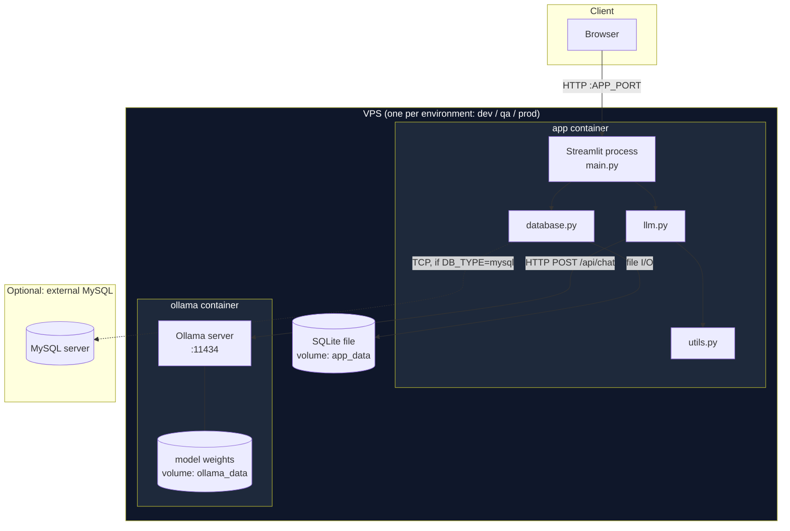
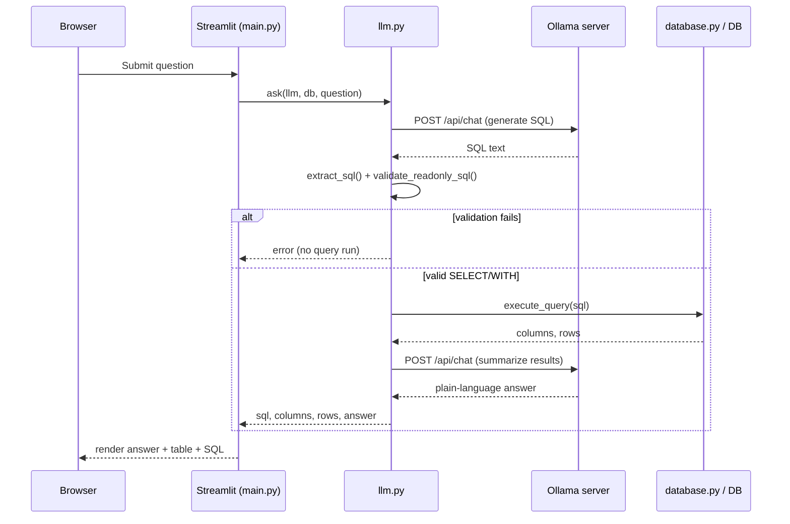
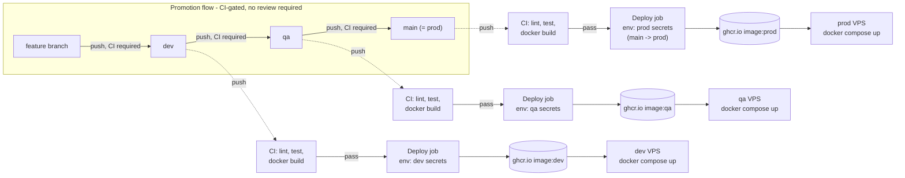

# Architecture

## Runtime: what sits where, per environment

Each environment (`dev`/`qa`/`prod`) is its own VPS running two containers
via Docker Compose. Nothing is shared between environments except the
container image (same image, different tag, promoted branch by branch).
The `prod` environment is deployed from the `main` branch — there is no
separate `prod` branch (see the CI/CD section below for why).

**Key point:** the app process never touches the model directly — it only
speaks HTTP to Ollama, which owns loading/unloading weights into RAM/VRAM.
That's why memory pressure on the box (see the "system running slow"
incident during development) is invisible to the app's own error handling;
it only surfaces as a slow or failed HTTP call.

## One question, stage by stage

Failure containment (see conversation history for the full breakdown):
generate-SQL failures, validation failures, query failures, and
generate-answer failures are each caught independently in `ask()` — a
failure at any later stage doesn't throw away results already computed at
an earlier stage.

## CI/CD pipeline

**There is no separate `prod` branch — `main` is prod.** A standalone
`prod` branch alongside `main` would just be a second "this is what's
live" claim that can silently drift from the first; `main` already carries
that meaning by GitHub convention, so the pipeline builds on it instead of
duplicating it.

**No human approval gate anywhere, by design.** CI passing is the only
thing standing between a push and a live deploy on every branch, including
`main`. A push straight to `main` deploys straight to prod once
`lint-and-test` and `docker-build` are green — there's no PR review
requirement and no required-reviewer approval on the `prod` Environment.
That's a deliberate trade-off for a solo/small-team setup where nobody's
signed up to be the reviewer; `docs/DEPLOYMENT.md` notes how to add a
manual approval gate later if that changes.

Every push to `dev`/`qa`/`main` re-runs the same `ci.yml` checks
(`lint-and-test`, `docker-build`) via `workflow_call` before `deploy.yml`'s
`deploy` job is allowed to run — so "passed CI" means the identical thing
whether it happened via a PR or a direct push. The `deploy` job resolves
`main` → the `prod` GitHub Environment explicitly (branch name and
environment name differ on purpose here); `dev`/`qa` map straight through.
That environment binding is what scopes secrets per-branch — see
`docs/DEPLOYMENT.md` for the exact GitHub settings.

## Where each piece sits (component inventory)

| Component | Process/artifact | Lives in | Talks to |
|---|---|---|---|
| Browser | client process | user's machine | Streamlit, over HTTP/WS |
| Streamlit + `main.py`/`llm.py`/`database.py`/`utils.py` | one Docker container (`app`) | VPS, per environment | Ollama (HTTP), SQLite (file) or MySQL (TCP) |
| Ollama server | one Docker container (`ollama`) | VPS, per environment | model weights on its own volume |
| SQLite demo DB | file on a named volume (`app_data`) | same VPS, mounted into `app` container | — |
| MySQL (optional) | separate DB server, not managed by this repo | wherever `DB_HOST` points | `app` container over TCP |
| GitHub Actions runners | ephemeral, GitHub-hosted | GitHub's infra | GHCR (push), VPS (SSH) |
| GHCR image registry | GitHub-hosted | GitHub's infra | pulled by each VPS on deploy |
